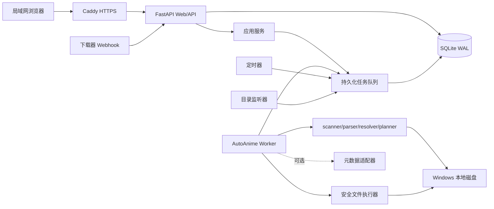

# AutoAnime v3：WebUI 与数据层

## 1. 文档状态

本文描述 **已经落地** 的 Web 控制台（Agent 工作台），不是待办设计稿。细节以 `autoanime_v3/db/schema.py`、`autoanime_v3/api/app.py`、`webui/src/` 为准。

- 版本：v3 Web Console，`SCHEMA_VERSION = 5`
- 平台：Windows 常驻；控制台 `http://127.0.0.1:8765`，静态资源来自 `webui/dist`
- 用户模型：单管理员；本机 loopback 默认可免密
- 产品形态：**Agent 工作台**（识别进度 + 记忆 + 绑定纠错会话），不是全局聊天首页
- 存储：多下载根、多媒体库根；**每个扫描方案只绑一对源/库**
- 无人值守：默认 qB `POST /api/v1/hooks/downloaders/{token}`；备选定时扫描；Worker 必须常驻
- 元数据：识别事实是核心；Bangumi/TMDB 海报简介只作附加展示
- 备份：可 `POST/GET /api/v1/backups` 做 SQLite 在线备份；**没有 restore HTTP API**

### 1.1 已实现的关键行为

1. `OrganizeAgent`（`autoanime_v3/organize.py`）编排 `group_work_units` → `resolve_unit` → `remember_resolution` → `planner.build_plan`。
2. 生产识别走 IdentifyAgent 批量，不在扫描中逐文件 aiparse。
3. `learned_show_memory` 覆盖层；纠正与审核应用会写记忆。`TitleCatalog.version` 变化使旧识别失效。
4. 向导创建 webhook/定时时 PATCH 该方案为 `execution_policy=auto_apply_safe`、`mode=link`。`CreateProfile` 默认仍是 `review_all`。
5. `auto_apply_safe` 条件：计划 `ready`、无 open review、无 conflict、`risk_level in {normal}`；通过后入队 `execute_plan`。
6. 纠错会话表 `agent_sessions` / `agent_messages`；未关闭会话对 `(kind, target_id)` 有部分唯一索引 `uq_agent_sessions_open`。
7. 提案允许：`title`、`media_type`、`season`、`episode`、`release_tag`、`aliases`、`reason`（`title_zh` 映射为 `title`）。禁止：`destination` / `dest` / `path` / `action` / `source` / `destination_path` / `destination_relative_path`。
8. `review` 应用 → `ReviewService.resolve`；`library` 应用 → `ChangeService.preview_show_change` + `CorrectionService.apply`。
9. Webhook body `extra=ignore`，路径别名：`path` / `paths` / `save_path` / `savePath` / `content_path` / `contentPath` / `folder`。路径必须在绑定源根内，否则 409（`PathOutsideRootError` 未单独映射，走默认 409）。
10. 导航：首页 / 扫描 / 待处理 / 运行记录 / 资料库 / 设置。待处理分页：需要确认 / 整理计划。锁定文案：`手动扫描`、`需要确认`、`全部批准并整理`、`开始整理已批准项`、`创建 Webhook`、`创建扫描方案`、`保存配置`。

## 2. 目标与非目标

### 2.1 目标

1. 在浏览器中完成当前 CLI 的全部主流程。
2. 所有高风险操作都先生成不可变计划，再经管理员批准执行。
3. 浏览器关闭、Web 服务重启或 Worker 重启不能丢失任务状态。
4. SQLite 同时保存资料库事实、任务状态、审核记录、操作历史和审计事件。
5. 同一套应用服务供 WebUI、Worker 和 CLI 使用，禁止不同入口各自拼 SQL 或移动文件。
6. 在 Windows 本地磁盘上安全支持 hardlink、copy 和 move。
7. 自动化事件只负责创建任务，不能绕过审核和执行策略直接修改文件。
8. 人工修改必须保留旧值、原因、修订号、受影响文件和回滚信息。

### 2.2 非目标

- 首期不支持多租户、多人协作或复杂角色权限。
- 首期不依赖 Redis、PostgreSQL、Celery 或 Kubernetes。
- 首期不把海报和简介作为识别或命名的强依赖。
- 首期不实现完整下载器客户端和媒体服务器客户端。
- 不提供跳过文件身份校验的强制删除、强制覆盖或强制回滚按钮。

## 3. 推荐架构

采用 FastAPI、React、SQLite 和独立 Worker 组成的模块化单体。



### 3.1 Web/API 进程

- 登录、退出、会话和 CSRF。
- 页面静态资源和 `/api/v1` JSON API。
- 配置、目录、计划、审核、资料库和历史查询。
- 创建任务、批准计划、提交纠正和请求回滚。
- 使用 SSE 推送任务事件。
- 不直接扫描磁盘，不直接执行 link/copy/move。

### 3.2 Worker 进程

- 领取持久化任务并维护租约和心跳。
- 执行扫描、识别、计划、元数据刷新、备份和一致性检查。
- 执行批准后的文件计划和补偿回滚。
- 运行定时器和 Windows 目录监听器。
- 同一时刻只允许一个有效 Worker 持有文件写入租约。

### 3.3 核心算法层

- Scanner 只发现文件并生成快照。
- Parser、Resolver 尽量保持无副作用。
- Planner 只生成不可变计划。
- Executor 只处理已经批准且预检查通过的计划项。
- 核心算法不能依赖 FastAPI 或 React。

## 4. 包结构

```text
autoanime_v3/
├─ organize.py / identify.py / identify_units.py / resolver.py
├─ scanner.py / parser.py / planner.py / executor.py / catalog.py
├─ aiparse.py / review.py / metadata.py
├─ db/schema.py          SCHEMA_VERSION 5
├─ db/migrations.py
├─ services/
│  ├─ scans.py / plans.py / operations.py / reviews.py
│  ├─ profiles.py / roots.py / webhooks.py / automation.py
│  ├─ agent_chat.py / memory.py / corrections.py / changes.py
│  ├─ settings.py / auth.py / backups.py（create/list；无 HTTP restore）
│  └─ metadata.py / rules.py / jobs.py
├─ api/app.py            /api/v1 单文件路由
├─ jobs/queue.py / worker.py
└─ integrations/metadata.py

webui/src/
├─ app/App.tsx
├─ features/agent / automation / dashboard / …
├─ pages/ConsolePages.tsx
└─ api/client.ts
```

CLI 仍保留 `library_service.py` / `repository.py` 作为一次性整理入口的边界；Web 不经这些模块改文件。

## 5. 数据层

### 5.1 数据库约束

- SQLite 开启 `foreign_keys=ON`、`journal_mode=WAL`、`busy_timeout`。
- Schema 通过迁移管理，禁止在 `__enter__` 中临时执行大段建表和 ALTER。
- 时间统一保存 UTC ISO 8601。
- Windows 路径保存原始显示值和规范化比较值。
- 业务服务通过 Unit of Work 提交一组数据库变更。
- 文件系统与 SQLite 不能宣称为同一原子事务，使用预检查、操作日志、补偿和最终核对。

### 5.2 系统和认证表

#### `users`

- `id`
- `username`，唯一
- `password_hash`
- `is_active`
- `password_changed_at`
- `created_at`、`updated_at`

#### `user_sessions`

- `id`
- `user_id`
- `token_hash`，唯一
- `csrf_hash`
- `created_at`、`last_seen_at`、`expires_at`
- `revoked_at`
- `client_ip`、`user_agent`

#### `app_settings`

- `key`，主键
- `value_json`
- `revision`
- `updated_at`

#### `secret_settings`

- `key`，主键
- `ciphertext`
- `provider`，Windows 默认 `dpapi`
- `updated_at`

API 只返回是否已配置和更新时间，不返回密文或明文。

#### `audit_events`

- 操作者、动作、对象类型和对象 ID。
- 修改前后摘要、原因、请求 trace ID、IP 和时间。
- 登录、配置修改、计划批准、执行、纠正、规则激活、密钥更新、备份和回滚必须写入。

### 5.3 存储和扫描配置表

#### `storage_roots`

- `kind`：`source`、`library`、`operations`、`metadata_cache`。
- `path`、`normalized_path`。
- `volume_serial`、`filesystem_type`。
- `enabled`、`health_status`、`last_checked_at`。

当前存在的 `normalized_path` 唯一。输出根不能等于输入根或位于输入根内部。

#### `scan_profiles`

- `name`
- `source_root_id`、`library_root_id`
- `mode`：`link`、`copy`、`move`
- `execution_policy`：`review_all`、`auto_apply_safe`、`dry_run`
- `min_confidence`
- `stability_seconds`
- `watch_enabled`
- `enabled`
- `revision`

#### `profile_rules`

- include/exclude glob。
- 支持的媒体和字幕扩展名。
- 未完成下载后缀。
- 最小文件大小和忽略目录。

#### `schedules`

- `profile_id`
- `kind`：`interval` 或 `daily`
- `schedule_json`
- `timezone`
- `next_run_at`、`last_run_at`
- `enabled`

#### `webhook_sources`

- 下载器名称、token 哈希、绑定 profile、启用状态和最后调用时间。
- Webhook 只能提交已配置根目录内的路径。

### 5.4 文件事实模型

#### `media_files`

表示某一代物理内容，不等同于某个路径。

- `id`
- `size`、`mtime_ns`
- `volume_serial`、`file_index`
- 可选 `sha256`
- `media_kind`
- `generation_status`
- `created_at`、`updated_at`

路径被不同大小、mtime 或文件 ID 的新文件复用时，创建新的 `media_files`，不能覆盖旧历史。

#### `file_locations`

- `media_file_id`
- `root_id`
- `path`、`normalized_path`
- `role`：`source`、`library`、`staging`
- `state`：`present`、`missing`、`replaced`、`deleted`
- `first_seen_at`、`last_seen_at`

一个 `media_files` 可以同时拥有下载源位置和媒体库硬链接位置。

#### `media_assignments`

- 当前接受的 show、season、episode。
- release/version 标签。
- title、season、episode、version 的人工锁。
- `revision` 和修改来源。

#### `identification_results`

- `media_file_id`
- 决策指纹、解析器版本和规则版本。
- 标题、季度、集号、类型、置信度、接受状态。
- `created_at`。

旧识别结果保留为历史，但只有当前 assignment 参与资料库事实和计划。

#### `identification_evidence`

- `result_id`
- agent、字段、值、置信度和 detail。
- 保存原始证据 JSON 供调试。

### 5.5 番剧和附加元数据表

#### `shows`

- 规范标题、规范化键、状态、修订号。
- 人工标题锁。

#### `seasons`

- `show_id`、季度号、显示标题和预期集数。

#### `episodes`

- `season_id`、集号、类型、显示标题和排序值。
- 特殊项使用 Season 00 和明确集号，不能全局猜为 E01。

#### `metadata_records`

- provider、provider ID、海报、本地海报缓存、简介、放送状态。
- `fetched_at`、`expires_at`、原始响应摘要。
- 元数据不可用时不阻塞核心整理流程。

### 5.6 任务和审核表

#### `jobs`

- 类型、状态、优先级、请求参数和幂等键。
- 进度计数、当前阶段、错误码和错误摘要。
- `lease_owner`、`lease_until`、`heartbeat_at`。
- `requested_by`、`created_at`、`started_at`、`finished_at`。

#### `job_events`

- `job_id`、递增序号、level、event_type、message、payload 和时间。
- SSE 按最后事件序号续传。

#### `scan_runs`、`scan_items`

- 保存扫描范围、文件快照、发现/忽略/识别统计和规则版本。

#### `review_items`

- 类型：低置信度、季集缺失、证据冲突、路径冲突、文件变化、规则失效。
- 状态：`open`、`resolved`、`dismissed`、`superseded`。
- 使用稳定 `dedup_key` 防止同一问题重复堆积。

### 5.7 计划、执行和纠正表

#### `plans`

- 不可变计划头。
- 来源 scan run、profile 修订号、规则版本和基础资料库修订号。
- 状态、摘要统计、批准人和批准时间。

#### `plan_items`

- source location、destination root 和相对路径。
- 动作、原因和风险级别。
- 源文件 ID、大小、mtime 和可选摘要快照。
- 识别结果快照和执行状态。

#### `operation_batches`、`operation_items`

- 保存执行批次、前后路径、摘要、结果、错误和补偿状态。
- 手动和自动回滚都创建新的 operation batch。

#### `change_requests`

- 修改目标、字段补丁、旧值、新值、原因和 `base_revision`。
- 文件迁移计划、冲突统计和状态。
- 修改影响路径时必须走批准和执行流程。

### 5.8 规则版本表

#### `rule_sets`、`rule_revisions`

- 规则以版本化 JSON 文档保存。
- 状态：草稿、已校验、已激活、已废弃。
- 激活版本生成内容哈希并进入识别决策指纹。
- 支持导入、导出、校验、激活和回退。
- 激活新规则不会自动移动已有文件，只会让相关识别结果失效并产生重新审核任务。
- 扫描过程 **不会** 调用 `RuleService.activate` 来持久化学到的别名。

### 5.9 记忆与纠错会话（Schema v5）

#### `learned_show_memory`

- 主键 `alias_key`，`canonical_title`，`source`（如 `identify_batch` / `review` / `library_correction`），`confidence`，`updated_at`。
- 作为 Identify / Organize 的覆盖层；`GET /api/v1/memory` 只读列出。

#### `agent_sessions` / `agent_messages`

- `kind ∈ {review, library}`，`status ∈ {open, applied, abandoned}`。
- 部分唯一索引：`uq_agent_sessions_open ON (kind, target_id) WHERE status = 'open'`。
- 消息 `role ∈ {user, assistant, system}`，提案在 `proposal_json`，服务端剥离路径类字段。

## 6. 状态机

### 6.1 Job

```text
queued -> leased -> running -> waiting_review | succeeded | failed | cancelled
                          \-> interrupted
```

租约过期的 running job 进入 interrupted，由恢复逻辑判断是否可安全重试。

### 6.2 Review

```text
open -> resolved | dismissed | superseded
```

### 6.3 Plan

```text
draft -> ready -> approved -> executing -> completed
               \-> stale
               \-> cancelled
executing -> failed_rolled_back | failed_needs_attention
```

批准后计划不可编辑。源文件、规则或基础修订发生变化时变成 stale。

### 6.4 Change Request

```text
draft -> validated -> approved -> applied
                   \-> stale
                   \-> rejected
applied -> reverted
```

## 7. 扫描和自动化流程

所有触发方式都只能创建扫描任务：

1. 手动扫描。
2. 定时扫描。
3. Watchdog 文件事件经去重和稳定性检测后创建 targeted scan。
4. 通用下载器 Webhook 创建指定 profile 的 targeted scan。

Watcher 必须：

- 合并短时间内重复事件。
- 等待大小和 mtime 稳定。
- 忽略临时后缀和未完成下载。
- 同一 profile 有活动扫描时合并请求。
- 不直接调用 Executor。

## 8. 计划批准和文件执行

1. Scanner 生成文件快照。
2. Resolver 保存识别结果和证据。
3. 不安全结果创建 review item。
4. 安全结果由 Planner 生成不可变 plan。
5. 管理员解决全部冲突并批准。
6. Worker 获取 profile、根目录和 plan 租约。
7. 执行前一次性检查整个批次：
   - 源文件存在且身份、大小、mtime 未变。
   - 目标路径不存在且位于 library root 内。
   - hardlink 位于同一卷。
   - copy/move 空间充足。
   - 计划、profile 和规则修订仍有效。
8. 任一预检查失败时，在修改文件前终止整个批次。
9. 逐项执行，保存结果摘要和文件身份。
10. 失败后逆序补偿。
11. 最终重新扫描受影响路径，更新 file locations。

执行过程中不允许覆盖已有目标。用户取消只能发生在安全边界；已经发生写入时必须完成当前文件并进入补偿流程。

## 9. 资料库修改

以下修改必须生成 change request：

- 规范番名。
- 季度和集号。
- 电影、OVA、SP 类型。
- 发布版本标签。
- 人工字段锁。
- 合并或拆分番剧。

修改预览必须展示字段差异、受影响文件、目标路径、冲突、数据库更新和文件迁移。使用 `base_revision` 做乐观并发控制。

## 10. API

统一前缀 `/api/v1`，同源部署，不开放任意 CORS。

进程级：

```text
GET    /health/live
GET    /health/ready          # {status, schema_version}
```

`/api/v1`（与 `autoanime_v3/api/app.py` 对齐，省略未实现项）：

```text
POST   /auth/login | /auth/logout | /auth/bootstrap | /auth/local-session
GET    /auth/me | /auth/bootstrap-status

GET    /dashboard
GET    /memory

POST   /agent/sessions
GET    /agent/sessions/{id}
POST   /agent/sessions/{id}/messages
POST   /agent/sessions/{id}/apply
POST   /agent/sessions/{id}/abandon

GET|POST /roots
POST   /roots/{id}/validate
PATCH|DELETE /roots/{id}
POST   /system/pick-folder

GET|POST /profiles
PATCH|DELETE /profiles/{id}     # PATCH 可改绑 source_root_id / library_root_id，revision+1

GET|POST /schedules
PATCH|DELETE /schedules/{id}
GET|POST /webhook-sources
PATCH|DELETE /webhook-sources/{id}
POST   /hooks/downloaders/{token}   # 202；body 路径别名见 1.1
POST   /hooks/local                 # 本机信任开关 hooks.local_trust

POST   /jobs/scans
GET    /jobs | /jobs/{id} | /jobs/{id}/events
POST   /jobs/{id}/cancel

GET    /reviews
POST   /reviews/{id}/resolve

GET    /plans | /plans/{id}
DELETE /plans/{id}
POST   /plans/{id}/approve
POST   /plans/{id}/execute-approved
POST   /plans/{id}/items/{item_id}/approve|reject

GET    /operations | /operations/{id}
POST   /operations/{id}/rollback    # 202 入队 rollback_operation

GET    /library/shows | /library/shows/{id} | /library/files/{id}
POST   /library/changes/preview | /library/changes/impact
POST   /library/changes/{id}/approve

GET|POST /rules
POST   /rules/revisions …
GET|PATCH /settings
PUT    /settings/secrets/{key}

POST   /backups
GET    /backups
# 没有 POST /backups/{id}/restore
```

qBittorrent「Torrent 完成时运行」模板（工作台会生成，`%F` 为完成路径）：

```text
curl -s -X POST "http://127.0.0.1:8765/api/v1/hooks/downloaders/<token>" -H "Content-Type: application/json" -d "{\"path\": \"%F\"}"
```

约束：

- 写请求使用 CSRF；配置类更新带 `revision` 乐观并发。
- 列表当前实现为全量 `items` + `next_cursor: null`，不是完整游标协议。
- 错误返回 `code`、`message`、`details`。
- Job events 可供 SSE 续读。

## 11. WebUI 页面

### 11.1 视觉系统

深色运维工作台：识别进度、发行文件夹和记忆条数是主角，而不是浅色九宫格仪表盘。

### 11.2 导航

- 首页（skill 卡：未配目录 → 配目录；未配触发 → 配置 qB 通知 / 定时扫描；识别中 → 进度；待确认 → 问 Agent）
- 扫描（多根目录 + 方案列表「源 path → 库 path」；编辑可改绑；`手动扫描`）
- 待处理（`需要确认` / 整理计划；行内「问 Agent」打开纠错会话）
- 运行记录（jobs / operations，回滚）
- 资料库（搜索、标题纠正、问 Agent）
- 设置（general / automation / advanced：AI、规则、记忆表、本机免密与 Hook 信任）

规则、备份、原始 JSON 设置放在设置的高级页，不再占主导航。

### 11.3 关键页面

- 扫描方案：1 源 + 1 库；多源进同一库用多个方案。
- 无人值守向导：创建 Webhook 或定时后自动把该方案改为硬链接 + 安全项自动执行。
- 审核：证据源文件名 vs 识别名；纠错会话 dock。
- 计划：可全部批准或按项批准/拒绝；`全部批准并整理` / `开始整理已批准项`。
- 资料库纠正已真实改文件并合并误命名作品（预览 → 批准）。

## 12. 安全

- 密码使用 Argon2id。
- Session token 只保存哈希；Cookie 使用 HttpOnly、SameSite=Strict，HTTPS 时启用 Secure。
- 修改请求使用 CSRF token。
- 登录失败限速和短期锁定。
- 密钥使用 Windows DPAPI 加密；不在 API、日志和脱敏导出中回显。
- Webhook token 只保存哈希并绑定 profile。
- 所有文件路径必须位于登记根目录内。
- 规范路径后检查符号链接、目录联接和 reparse point。
- Windows 服务使用专用低权限账号。
- 所有关键操作写审计事件。

## 13. Windows 部署

生产运行需要 Python 3.11+。前端构建需要 Node.js 20+（本机可用 npm 或 pnpm）。

双击根目录 `start-autoanime.bat`（实现见 `scripts/autoanime.ps1`）：

- 启动 **同一 `--data-dir` 的 Web + Worker**
- 等待 `GET /health/live`
- PID 写在 `%DataDir%\run\web.pid` 与 `worker.pid`，停止只杀这一实例
- 前端 dist 仅在源码比产物新时重建；`-NoBuild` 跳过
- 端口占用会报 PID，不会把 e2e 残留进程当成“已经启动”

```text
C:\ProgramData\AutoAnime\
├─ data\library.sqlite3
├─ logs\
├─ operations\
├─ run\web.pid
└─ run\worker.pid
```

自定义：

```powershell
.\start-autoanime.bat -DataDir "D:\AutoAnimeData" -Port 8765 -NoBuild
.\status-autoanime.bat
.\stop-autoanime.bat
.\stop-autoanime.bat -Force   # 结束所有 AutoAnimeWeb/Worker，含测试残留
```

WinSW 模板在 `deploy/windows/`。生产建议 Web 只绑 `127.0.0.1`，用 Caddy 提供 HTTPS，不要加 `--insecure-http`。

隔离测试数据应放在如 `F:\test\…`，不要用测试去写生产 `C:\ProgramData\AutoAnime` 或用户的正式媒体库。

## 14. 备份和诊断

- `BackupService.create` 使用 SQLite Online Backup API；API 可创建和列出。
- `BackupService.restore` 存在于服务层且要求 maintenance_mode，**未挂 HTTP**。不要文档化一键恢复按钮。
- DPAPI 密文不能跨机器直接用。
- 数据库备份 ≠ 媒体文件备份。

## 15. 日志和可观测性

- JSON 结构化日志包含 `trace_id`、`job_id`、`run_id`。
- Web、Worker、Watcher 和 Scheduler 保存心跳。
- `/health/live` 检查进程；`/health/ready` 检查数据库、迁移和 Worker。
- Job events 是任务恢复和 SSE 的事实来源，普通日志不承担状态恢复。
- 审计日志与调试日志分离。

## 16. 测试策略

### 16.1 后端单元测试

- Schema、迁移和约束。
- 路径规范化和根目录逃逸。
- 密码、session、CSRF 和密钥脱敏。
- Job、Review、Plan 和 Change Request 状态机。
- 规则版本和决策指纹。

### 16.2 文件操作集成测试

- Windows hardlink、copy、move。
- 跨卷 hardlink 拒绝。
- 源文件变化、目标替换和路径复用。
- 中断、补偿、staging 保留和安全回滚。
- 源位置和媒体库位置同时存在。

### 16.3 API 测试

- 登录、过期、撤销、CSRF 和限速。
- 幂等键和乐观并发。
- SSE 续传。
- 未登录和失效计划拒绝。
- 密钥不回显。

### 16.4 前端测试

- Vitest 组件和状态测试。
- Playwright 登录、配置、扫描、审核、批准、执行和回滚流程。
- 桌面和移动布局。
- 键盘导航、focus、颜色对比和 reduced motion。

### 16.5 验收标准

- 重启不丢任务。
- Worker 崩溃不会重复执行未知状态的文件操作。
- 源文件变化导致计划拒绝。
- 路径逃逸、覆盖和不安全回滚被拒绝。
- 人工锁不会被 agent 覆盖。
- 密钥不出现在 API、页面源码、日志和导出中。
- Watcher 只创建任务。
- 元数据不可用不阻塞整理。
- 完整自动化测试、前端构建和浏览器核心流程通过。

## 17. 实施状态

上列 1–9 已在当前分支落地（含 Schema v5、OrganizeAgent、纠错会话、qB 向导）。后续只改代码与测试，不再把本文当施工清单。历史计划见 `docs/superpowers/plans/`。
