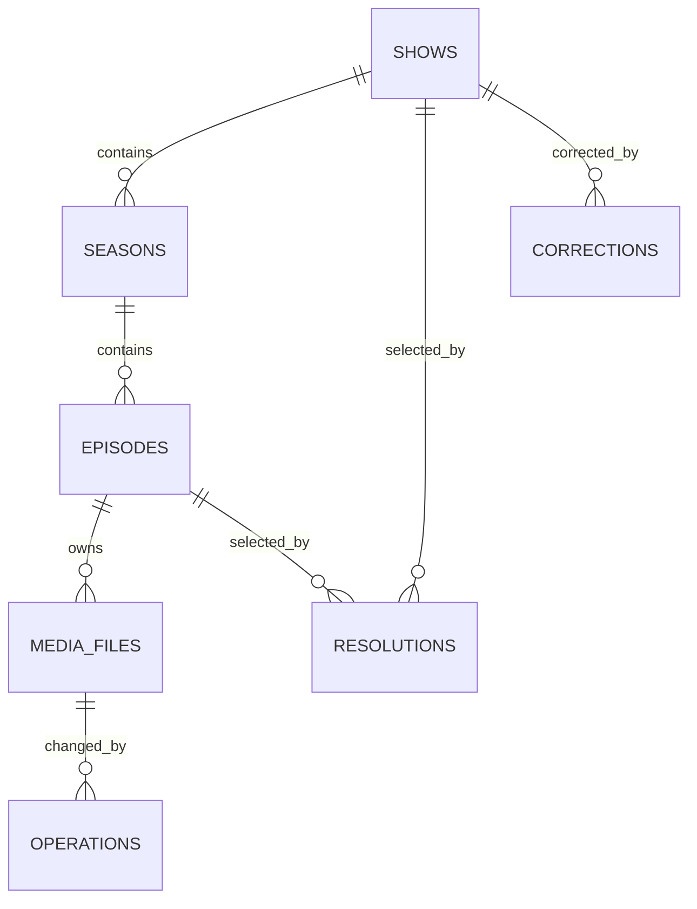

# AutoAnime v3：WebUI 与数据层规划

## 目标

v3 不再把所有状态塞进难以人工维护的 JSON 缓存。`.autoanime-v3/library.sqlite3` 同时承担：

- 自动识别结果缓存；
- 番剧、季度、剧集与媒体文件索引；
- 整理操作和失败历史；
- 人工纠正草案及对应的文件迁移计划；
- 未来 WebUI 的唯一事实来源。

SQLite 是唯一持久化事实来源；别名和季度规则保留为可审阅的 JSON 配置，不保存运行进度。

## 数据模型

- `shows`：统一番剧实体与修订号。
- `seasons`：季度编号、可选标题、预期集数。
- `episodes`：季度内集号与可选标题。
- `media_files`：以规范化 `source_key` 保持每个物理来源只有一条当前事实，记录原始路径、当前路径、当前决策指纹、发布源和状态。
- `resolutions`：某个文件为何被识别成某番某集，保留置信度和证据。
- `operations`：每次 link/copy/move 的结果，供审计与回滚。
- `corrections`：人工修改前后值、原因、状态和迁移计划。
- `show_progress`：供 UI 首页直接读取的季度完成度视图。

## 服务边界

WebUI 不直接操作数据库或文件系统，统一调用 `autoanime_v3.library_service.LibraryService`：

- `list_shows()`：番剧与各季度已识别/已整理集数；
- `get_show(show_id)`：季度、集、文件版本和当前位置；
- `preview_show_title_change(...)`：只针对已整理文件生成纠正草案和迁移预览，保留现有多版本后缀并报告重复/已存在目标；
- `apply_correction(...)`：v3.1.1 暂不实现，后续需加入锁、冲突检查、事务日志与失败回滚。

CLI 与 WebUI 必须复用同一服务，避免出现“网页改了数据库但文件没动”或“文件动了但资料库没更新”的双写问题。

## WebUI 页面草案

1. **概览**：番剧数、季度数、已整理集数、待确认数、冲突数、最近失败。
2. **番剧列表**：中文主名、别名、季度进度、最近整理时间、异常标记。
3. **番剧详情**：季度/集树、同集多版本、原路径、现路径、识别证据。
4. **待确认队列**：英文未收敛、季集缺失、AI 与本地冲突、目标路径冲突。
5. **纠正向导**：修改主名/季度/集号，先显示所有将迁移的文件，再确认执行。
6. **操作历史**：按批次查看、筛选失败、执行回滚。

## 后续实施阶段

### 阶段 A：只读 WebUI

- 使用 FastAPI 提供只读 JSON API；
- 页面展示 `show_progress`、详情、待确认队列和操作历史；
- 不提供任何会改数据库或文件的按钮。

### 阶段 B：纠正草案

- WebUI 可创建 `corrections(status=draft)`；
- 后端计算路径迁移计划、重复目标和磁盘边界；
- 用户确认前不改文件、不改番剧主数据。

### 阶段 C：安全应用

- 对受影响番剧加数据库租约锁；
- 再次校验文件指纹和目标冲突；
- 写入操作批次后逐项迁移；
- 全部成功才更新主数据和 `media_files.current_path`；
- 失败时按反向操作回滚，并保留完整审计记录。

### 阶段 D：权限与远程访问

- 默认仅监听 `127.0.0.1`；
- 若允许局域网访问，必须加入登录、CSRF 防护和操作二次确认；
- API 密钥继续由环境变量或系统密钥环管理，不写入数据库页面。

## 关键约束

- 任何人工纠正都不能直接覆盖历史；必须保留旧值、原因和操作者。
- 文件迁移默认不覆盖目标；同集多版本保留来源标签。
- 纠正预览不能把仅识别、尚未整理的下载文件误当成已入库文件迁移。
- 自动 agent 不能覆盖人工锁定的标题/季/集。
- 解析器或规则版本变化后，旧识别缓存通过指纹中的版本号自动失效。
